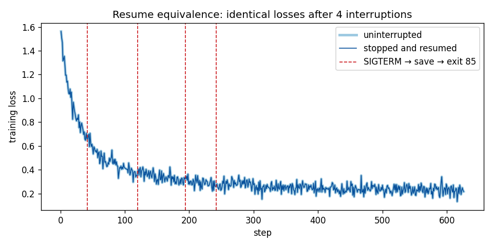

# Recipe 0: the minimal checkpointing job

The smallest complete example of a training job that survives HTCondor. It saves its state on a timer and when HTCondor asks it to leave, it tells HTCondor "restart me", and it resumes exactly where it stopped.

The model is deliberately boring: one line, `torch.nn.Linear(32, 4)`, trained on made-up data. Read [`train.py`](train.py) for the five blocks marked `# ===== CHECKPOINT =====`. Those are what your own job needs.

## The five things your job needs

**1. A signal flag.** To evict a job (a vacate, a hold, a backfill slot being reclaimed), HTCondor sends **SIGTERM**, then kills the job about **600 seconds** later. The handler only records the request:

```python
stop_requested = False

def on_sigterm(signum, frame):
    global stop_requested
    stop_requested = True

signal.signal(signal.SIGTERM, on_sigterm)
```

Don't save inside the handler. It can run in the middle of `optimizer.step()`, when the model is half-updated.

**2. An atomic save.** Write the checkpoint to a temporary file, then rename it over the real one:

```python
torch.save(state, CHECKPOINT + ".tmp")
os.replace(CHECKPOINT + ".tmp", CHECKPOINT)  # the all-at-once step
```

A rename happens all at once. So even if the job is killed in the middle of a save, `checkpoint.pt` is always either the old complete checkpoint or the new one, never half of one. The checkpoint holds everything needed to continue as if nothing happened:

| Saved | Why | Without it |
|---|---|---|
| model weights | the thing you're training | start over |
| optimizer state (AdamW moments) | the optimizer's memory of past steps | a loss spike after every restart |
| LR scheduler | where you are in the schedule | wrong learning rate |
| step, epoch, batch index | where you are in the data | repeated or skipped batches |
| RNG states (Python, NumPy, torch, CUDA) | real models draw random numbers while training (dropout, data augmentation). This tiny one doesn't, but it saves them anyway, as yours should | a resumed run quietly behaves differently |

**3. Resume.** At startup, if `checkpoints/checkpoint.pt` exists, load it and put everything back; otherwise start fresh. So the *same command* works for the first start and every restart. A half-written `checkpoint.pt.tmp` from a killed save is never loaded, and the next save overwrites it.

**4. A stop check at every step boundary.** If HTCondor asked us to stop, *or* our own time limit is up: save, then exit with code **85**.

```python
if stop_requested or time.time() - start_time >= args.max_runtime_seconds:
    save_checkpoint("signal" if stop_requested else "timed")
    sys.exit(85)   # "state saved, please restart me"
```

The checkpoint is the state after the last *completed* step, and the data position points at the next batch. The wait is one step: seconds at most, well inside the 600 s.

**5. Finish.** Exit **0** only when training is really done. HTCondor then treats the job as complete.

## What happens when HTCondor stops your job

**Timed checkpoint** (every `--max-runtime-seconds`, default 1 hour):
```
timer fires → save → exit 85 → HTCondor saves the checkpoint directory → restarts the job, usually in place, within seconds
```

**Eviction** (`condor_vacate_job`, `condor_hold`, backfill preemption, and, per CHTC's policy, reaching the GPU runtime limit with `+is_resumable`):
```
SIGTERM → finish the current step → save → exit 85 → HTCondor saves the checkpoint directory
        → job is rescheduled (often on another machine, ~1–2 minutes) → train.py picks up the new save
```

**Hard kill** (`condor_vacate_job -fast`, a machine crash, an OSPool glidein ending):
```
SIGKILL, no warning → job restarts from its last timed checkpoint
```

That last case is why the timed checkpoint matters. It is the only protection against hard kills, and on the OSPool most interruptions arrive without a SIGTERM.

## The submit-file lines that matter

From [`job_chtc.sub`](job_chtc.sub) (every line there has a comment explaining it):

```
shell                     = exec python3 train.py --max-runtime-seconds 3600
transfer_input_files      = train.py
checkpoint_exit_code      = 85
transfer_checkpoint_files = checkpoints
when_to_transfer_output   = ON_EXIT_OR_EVICT
transfer_output_files     = checkpoints
kill_sig                  = SIGTERM
container_image           = osdf:///chtc/staging/<user>/<path>/recipe0.sif
```

- **`shell = exec python3 …`** runs the command. Keep the `exec`: HTCondor sends SIGTERM only to the job's top process, and `exec` makes Python that process instead of the shell. Without it, Python never hears the SIGTERM. ([`run.sh`](run.sh) does the same thing as a script, if you prefer `executable = run.sh`.)
- **`container_image`** runs the job inside your container. No `universe` line is needed.

- **`checkpoint_exit_code = 85`:** exit 85 means "restart me". Without this line, exit 85 just ends the job.
- **Without `when_to_transfer_output = ON_EXIT_OR_EVICT`,** HTCondor throws away the save made after SIGTERM. The job then falls back to its last timed checkpoint. We measured both.
- **List one directory** in `transfer_checkpoint_files`, and create it at startup (`train.py` does). A listed path that doesn't exist puts the job on hold.
- **Name that directory in `transfer_output_files` too.** By default HTCondor copies back only new top-level files, never directories. Without this line, `ON_EXIT_OR_EVICT` has nothing useful to save at an eviction, and the save made after SIGTERM is lost (our first test run did exactly that).

[`job_ospool.sub`](job_ospool.sub) is the same job on the OSPool (`want_ospool = true`).

## Run it

1. **Build the container** ([`container.def`](container.def): Python 3.12, CPU-only PyTorch, NumPy) in a CHTC interactive build job:
   ```
   apptainer build recipe0.sif container.def
   ```
   Copy the result to your `/staging` directory.
2. **Edit the submit file:** put that path in `container_image = osdf:///chtc/staging/<user>/<path>/recipe0.sif`.
3. **Submit:** `condor_submit job_chtc.sub` (or `job_ospool.sub`).
4. **Watch it:** `job.out` collects the output of every run, because HTCondor appends to it across restarts. Look for `SAVED`, `EXIT 85` and `RESUMED from step …` lines.

## Test it

**Locally** (no HTCondor, about a minute on a laptop CPU):
```
pip install -r requirements.txt matplotlib
python test_local.py
```

The script checks three things:
- **Resume equivalence.** A run stopped with SIGTERM four times at random moments, and resumed each time, logs exactly the same losses as an uninterrupted run.
- **Timed exit.** `--max-runtime-seconds` makes the job save and exit 85, and the rerun resumes.
- **Interrupted save.** A half-written `checkpoint.pt.tmp` is ignored.



The resumed run matches the uninterrupted one **bit for bit** at every step. That's because everything the next step depends on is restored (weights, optimizer, scheduler, the exact data order and position, the RNG states), and PyTorch is set to deterministic kernels. On a GPU, some kernels are nondeterministic, so expect agreement to a small tolerance instead.

**On HTCondor** (on the access point, in this directory, about 10 minutes each):
```
./test_htcondor.sh job_chtc.sub vacate    # resumes from the save made after SIGTERM
./test_htcondor.sh job_chtc.sub hold      # hold + release: same
./test_htcondor.sh job_chtc.sub fast      # hard kill: resumes from the last timed checkpoint
./test_htcondor.sh job_ospool.sub timed   # timed checkpoints only
./test_htcondor.sh job_chtc.sub inspect    # copy out the kept checkpoint with condor_evicted_files
```

Each prints the job's `SAVED` / `RESUMED` lines and a PASS or FAIL. The script reads only the job's event log, so it doesn't load the scheduler.

## Inspecting your checkpoint

When a resume doesn't do what you expect, look at the checkpoint HTCondor actually kept. This is the workflow from the HTCondor manual ("Debugging Self-Checkpointing Jobs"):

```
condor_vacate_job <job>            # evict the job: it saves and exits 85
condor_hold <job>                  # right away, so it can't restart and overwrite what was kept
condor_evicted_files get <job>     # copies the kept files into a subdirectory named <job>/
condor_release <job>               # let the job continue
```

On CHTC, for this recipe, `condor_evicted_files` returned exactly `<job>/checkpoints/checkpoint.pt`: the save made after SIGTERM, which the released job then resumed from. To see what's inside, load it where PyTorch is available (e.g. in an interactive job with the same container):

```
python3 -c "import torch; s = torch.load('<job>/checkpoints/checkpoint.pt', weights_only=False); print('step', s['step'], 'epoch', s['epoch'], 'batch', s['batch_index'], 'reason', s['reason'])"
```

`./test_htcondor.sh job_chtc.sub inspect` runs the whole workflow and checks the result.

For a CPU job like this one, `condor_ssh_to_job <job>` also opens a shell inside the running job's directory. (On CHTC it is turned off for GPU jobs.)

## Adapting it to your job

Copy the five blocks. Then make sure:
- **Everything that changes during training is in the `state` dictionary in `save_checkpoint`:** model, optimizer, scheduler, counters, data position, RNG states. Then check that the resume block restores each one.
- **Your data order can be rebuilt from `(epoch, batch_index)`** (seeded shuffling per epoch), or save your data loader's state.
- **The checkpoint interval matches the work you can afford to redo.** An hour is a reasonable start; restarts in place cost only seconds.
- **On GPUs:** add the commented GPU lines in the submit file, including `+is_resumable = true`. Use a CUDA-enabled PyTorch image.
- **Keep `exec`** in front of your command in the `shell` line.

**What recipe 0 leaves out, on purpose:** keeping several checkpoints and falling back to an older one if the newest is damaged, forcing saves onto disk with `fsync` (it matters when checkpoints live on `/staging`), checkpointing at epoch boundaries vs. during epochs, and exporting the best model. Recipe 1 adds all of these.
